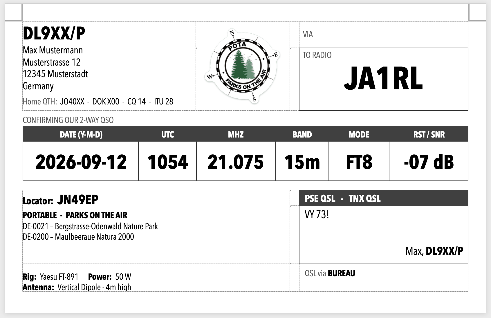
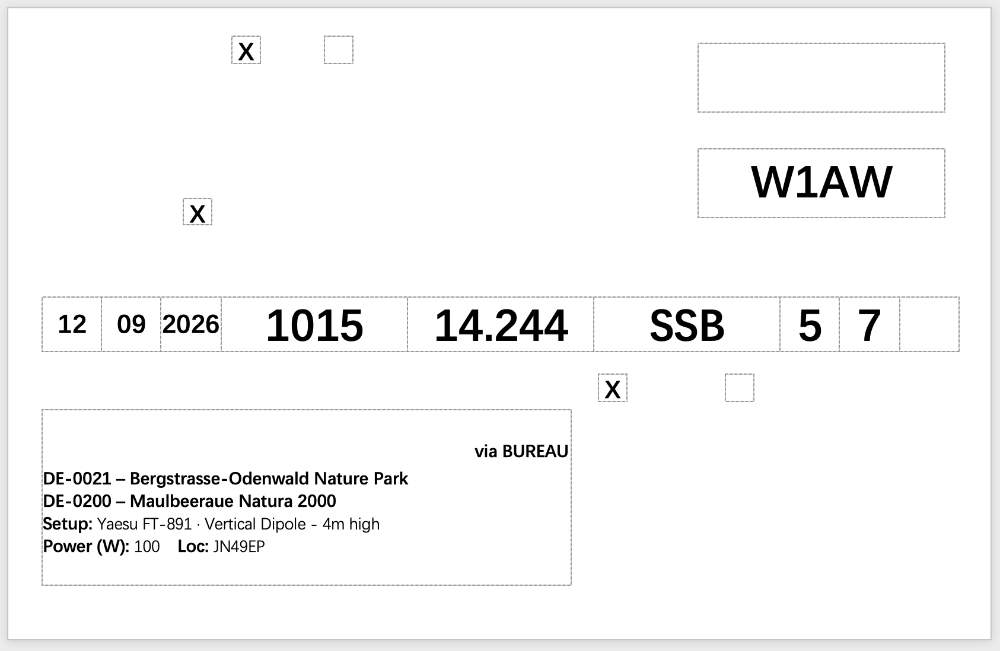

# 📮 wavelog-qsl-convert

> From your Wavelog export to print-ready QSL cards — sorted for the bureau, with POTA parks, FT8 reports and envelopes for direct cards.

Filling in QSL cards by hand is slow, and a raw log export does not fit a card: frequency in Hz, dates as `2026-04-14`, FT8 reports that do not fit an RST box, POTA references without park names. This tool turns a [Wavelog](https://www.wavelog.org/) export (ADIF or CSV) into a clean mail-merge file and ships Word templates that print the cards for you.



## ✨ What you get

- **Print-ready cards from one command.** One CSV drives three Word templates: a full card back for blank stock, an overlay for pre-printed cards, and envelopes.
- **Cards come out in bureau order.** Bureau cards are grouped by main prefix the way the DARC QSL bureau asks for them (USA by call area, including the W4/WA4 split), so the stack is sorted when it leaves the printer.
- **Bureau and direct in one export.** Bureau cards print first, direct cards after, and every card carries a `via BUREAU` / `via DIRECT` marker.
- **Envelopes for direct cards.** Postal addresses are looked up on QRZ.com, including QSL managers named in the `QSL_VIA` field. Envelope *n* matches card *n*.
- **POTA aware.** Park names are fetched from the POTA API and printed next to the reference, up to four parks per QSO (n-fers). The card is marked *Portable* automatically.
- **FT8 done right.** The SNR is printed as `-07 dB`, or spread over the three R/S/T boxes of a pre-printed card.
- **Your actual location.** The card shows the locator you operated from, not just your home QTH.
- **Rig and antenna on the card**, taken from two simple tags in the Wavelog comment.
- **No dependencies.** One Python file, standard library only.

---

## 🚀 Quick Start

### 1. Requirements

- Python 3.9 or newer (no extra packages)
- Microsoft Word for the templates (tested with Word for Mac)
- Optional: a QRZ.com account with XML data access, for envelope addresses

### 2. Export your QSOs from Wavelog

Export the QSOs you want cards for as **ADIF** (recommended) or CSV, for example from Wavelog's QSL print queue. ADIF carries everything the cards need (power, your locator, POTA references, bureau/direct).

### 3. Convert

```bash
python3 qsl_convert.py my-export.adi
```

```
✓ 5 Einträge konvertiert → my-export_seriendruck.csv
  Versand: BUREAU 4, DIRECT 1
```

The result is `my-export_seriendruck.csv` next to your export. Want to try it first? A sample log is included:

```bash
python3 qsl_convert.py examples/sample.adi --no-qrz
```

### 4. Print with Word

1. Open one of the templates (see [Templates](#-templates)).
2. *Mailings → Select Recipients → Use an Existing List…* and pick the `_seriendruck.csv` file.
3. *Preview Results* to page through the cards, then *Finish & Merge → Print Documents*.

Word asks once whether it may read the data file. Answer *Yes*.

---

## 🖨️ Templates

All templates are 5.5 × 3.5 inch (140 × 89 mm) and use the same CSV.

| Template | Use it for |
|---|---|
| `QSL_Blanko.docx` | **Blank card stock.** Prints the complete card back in one pass, black and grey only (made for a monochrome laser printer). |
| `QSL_Seriendruck.docx` | **Pre-printed cards.** Prints only the QSO data into the boxes of an existing card. |
| `umschlaege.docx` | **Envelopes** for direct cards, fed by the `_umschlaege.csv` file. |

### Blank card: `QSL_Blanko.docx`

- **Top left:** your call sign (taken from the log, so `S5/DL9XX` prints correctly), name, address and home QTH data.
- **Top right:** room for a `VIA` manager and the `TO RADIO` box with the other station's call, the largest element on the card.
- **QSO table:** date (`YYYY-MM-DD`), UTC, MHz, band, mode and report. The report shows `-07 dB` for FT8, `57` for SSB and the raw value otherwise.
- **Location block:** the locator you operated from, then `PORTABLE - PARKS ON THE AIR` with the parks. Without POTA it shows `PORTABLE` when the locator differs from your home locator, and nothing when you were at home.
- **Station block:** rig, power and antenna.
- **Bottom right:** `PSE QSL` (plus `TNX QSL` when you already received a card), your greeting, and the `QSL via BUREAU` / `DIRECT` marker.
- **POTA logo:** only printed for QSOs with a park reference.

### Pre-printed card: `QSL_Seriendruck.docx`



Prints call sign, date, time, frequency, mode and report into fixed positions, plus an `X` in the *Portable* box for POTA QSOs and a block with parks, setup, power and locator. The positions match one specific card layout. For your own cards, move the tables in Word until they sit on your boxes.

### Make the templates yours

The templates ship with placeholder station data (`DL9XX`, `Max Mustermann`, `JO40XX`, `DOK X00`). Before the first print:

1. Replace name, address, home locator, DOK and zones with your own.
2. In `QSL_Blanko.docx`, press <kbd>Alt</kbd>+<kbd>F9</kbd> to show field codes and replace `JO40XX*` in the *Portable* condition (bottom left) with your home locator.
3. `QSL_Blanko.docx` uses the font *Avenir Next Condensed* (included with macOS). On other systems pick a condensed font, otherwise columns may get tight.

---

## 🧩 How the details work

### Rig and antenna

Put two tags into the Wavelog comment of a QSO:

```
[antenna] Vertical Dipole - 4m high [rig] Yaesu FT-891
```

They end up in the columns `ANTENNE`, `RIG` and `SETUP` (`Yaesu FT-891 · Vertical Dipole - 4m high`). Any text before the first tag stays in `BEMERKUNG` as a normal remark.

### POTA

- Several references (`DE-0021,DE-0200`) are supported; duplicates are dropped.
- Names come from `https://api.pota.app/park/<REF>` with the park type appended, as shown on pota.app (`Wetterau Bird Sanctuary`). Each reference is queried once per run.
- Word mail merge has no loops, so parks are written to fixed columns `POTA_1` … `POTA_4` (`DE-0021 – Bergstrasse-Odenwald Nature Park`); unused ones stay empty. `--pota-slots N` changes the number.
- If a reference is unknown or the API is unreachable, you get a warning and the name stays empty. The conversion still completes.

### Sorting

Sorting follows `QSL_SENT_VIA` from your log:

1. **Bureau (`B`)** first, grouped by main prefix, then by call sign.
2. **Direct (`D`)**, by date and time.
3. **Everything else**, by date and time.

The bureau grouping uses the [prefix list of the DARC QSL bureau](https://www.darc.de/geschaeftsstelle/qsl-buero/) (edition 4/18), which is built into the script:

- All German prefixes (`DA`–`DR`) form the group `DL`.
- USA is grouped by the digit in the call sign (`W0` … `W9`). Two letters before a 4 (`AA4`, `KA4`, `WA4`) go to `WA4`, the rest to `W4`.
- Portable call signs count by home call: `LA/DL9XX/P` → `DL`.
- The group is written to the column `DARC_GRUPPE`, handy for the band around each bundle.
- Unknown prefixes go to the end of the bureau cards, with a warning.

The list dates from 2018. Newer prefixes can be added to `DARC_PREFIXLISTE` in the script.

### Envelopes for direct cards

For every QSO with `QSL_SENT_VIA` = `D` the script also writes `<export>_umschlaege.csv` with the postal address from the QRZ.com XML database.

- **Credentials:** set `QRZ_USERNAME` and `QRZ_PASSWORD`, or let the script ask in the terminal. The password is not echoed and never stored. An empty password skips the step.
- **QSL managers:** if `QSL_VIA` names another call sign (`QSL VIA ONLY KU9C`), the manager's address is used. Plain remarks such as `NO BURO, DIRECT only!` are ignored.
- **Portable call signs** are looked up by home call (`OE1RDU/3` → `OE1RDU`).
- **One row per QSO**, in the same order as the direct cards. Each call sign is queried only once.
- **Missing addresses** are listed at the end and marked in the `Status` column.

### FT8 and RST

- **FT8:** `RST_SENT_FT8` holds `-07 dB`. For pre-printed cards the three characters are also split into `RST_R` / `RST_S` / `RST_T` (`-`, `0`, `7`).
- **SSB:** `59` becomes R `5`, S `9`.
- **Other modes** (CW, …): split the same way, and the raw value is kept.

---

## ⚙️ Options

```bash
python3 qsl_convert.py <export.adi|export.csv> [output.csv] [options]
```

| Option | Effect |
|---|---|
| `--no-pota` | Do not query the POTA API for park names |
| `--pota-slots N` | Number of `POTA_n` columns (default 4; extend the template to match) |
| `--no-qrz` | Do not look up envelope addresses |
| `--umschlaege FILE` | Output name for the envelope CSV |
| `--qrz-delay SEC` | Pause between QRZ queries (default 1.0) |

<details>
<summary><b>📋 Column reference</b></summary>

Column names and console messages are German. The mail-merge CSV is UTF-8 with BOM, all fields quoted.

| Source field | Column | Example |
|---|---|---|
| `CALL` | `AN_RUFZEICHEN` | `W1AW` |
| `STATION_CALLSIGN` | `EIGENES_CALL` | `DL9XX/P` |
| `QSO_DATE` / `DATE_ON` | `DATUM_T`, `DATUM_M`, `DATUM_J` | `12`, `09`, `2026` |
| `TIME_ON` | `UTC_ZEIT` | `1015` |
| `FREQ` | `FREQUENZ` (MHz) | `14.244` |
| `BAND` | `BAND` | `20m` |
| `MODE` | `BETRIEBSART` | `SSB` |
| `RST_SENT` | `RST_SENT_FT8`, `RST_R`, `RST_S`, `RST_T` | `-07 dB`, `-`, `0`, `7` |
| `QSL_RCVD` | `TNX_QSL` | `X` if received |
| — | `PSE_QSL` | always `X` |
| `TX_PWR` | `LEISTUNG_W` | `100` |
| `MY_GRIDSQUARE` | `EIGENER_LOCATOR` | `JN49EP` |
| `MY_POTA_REF` | `POTA_REF`, `POTA_NAME`, `POTA_ANZAHL`, `POTA_1` … `POTA_4` | `DE-0021 – Bergstrasse-Odenwald Nature Park` |
| `COMMENT` | `ANTENNE`, `RIG`, `SETUP`, `BEMERKUNG` | `Yaesu FT-891 · Vertical Dipole - 4m high` |
| `QSL_SENT_VIA` | `VERSAND` | `BUREAU`, `DIRECT`, `ELECTRONIC`, `MANAGER` |
| `CALL` | `DARC_GRUPPE` | `DL`, `JA`, `W1` |
| `QSL_VIA`, `GRIDSQUARE`, `COUNTRY` | `QSL_VIA`, `GRIDSQUARE`, `ENTITY` | unchanged |

Envelope CSV (`;` separated): `Rufzeichen`, `Via_Rufzeichen`, `QRZ_Rufzeichen`, `Datum`, `Band`, `Vorname`, `Nachname`, `Adresse`, `Ort`, `Bundesland`, `PLZ`, `Land`, `Status`.

A CSV export from Wavelog works too, but only contains power, locator, POTA and bureau/direct if those columns are part of the export. Missing fields never abort the run; the column just stays empty.

</details>

---

## 🔒 Privacy and third-party services

- Log exports and the generated CSV files contain call signs, remarks and postal addresses of other people. They are excluded from Git via `.gitignore`. Keep them out of public places.
- The script contacts `api.pota.app` (park names) and, only if you provide credentials, `xmldata.qrz.com` (addresses). Nothing else leaves your machine.
- Not affiliated with Wavelog, DARC, Parks on the Air or QRZ.com.

73!
